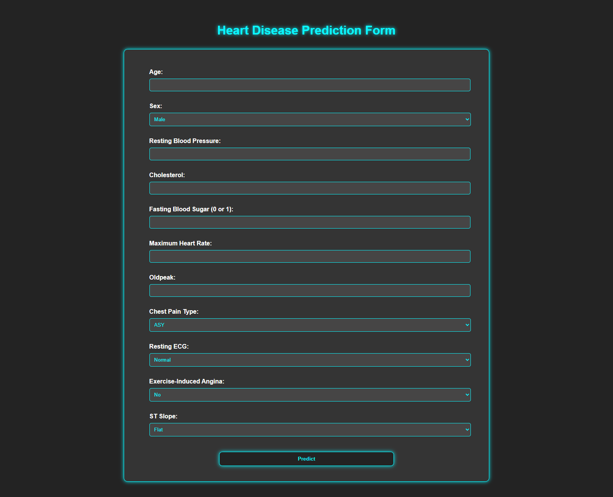
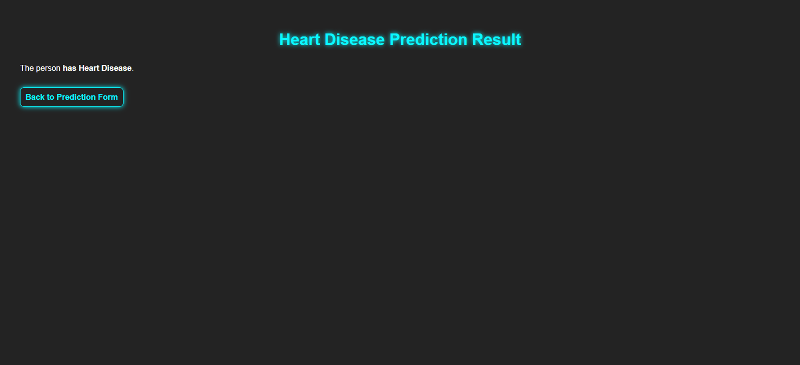

# ❤️ Heart Disease Prediction System using Machine Learning

This is a machine learning-powered web application developed with Python, XGBoost, and Flask, designed to predict whether a person is likely to have heart disease based on clinical and diagnostic inputs.

## 🚀 Features
- Predicts heart disease likelihood using real patient health indicators.
- Built with an optimized XGBoost classifier (hyperparameter tuned).
- Clean and interactive UI built using Flask and HTML/CSS.
- Handles preprocessing: outlier removal, encoding, and scaling.
- Includes `model_columns.json` and `scaler.pkl` to ensure consistent input during prediction.

## 🩺 Input Parameters
- Age
- Sex (M/F)
- Chest Pain Type (ATA, NAP, ASY, TA)
- Resting Blood Pressure
- Cholesterol
- Fasting Blood Sugar (0/1)
- Resting ECG (Normal, ST, LVH)
- Max Heart Rate Achieved
- Exercise-Induced Angina (Y/N)
- Oldpeak (ST depression)
- ST Slope (Flat, Up, Down)

## 🧰 Technologies Used
- Python
- Pandas, NumPy, Scikit-learn – Data preprocessing & model tuning
- XGBoost – Core ML model
- Flask – Lightweight web server
- HTML, CSS – Frontend design
- Pickle, JSON – Model & metadata serialization

## 📁 Files Included
- `app.py` – Flask app entry point
- `templates/` – Contains `index.html` and `result.html`
- `static/styles.css` – External CSS for UI styling
- `heart_train.csv` – Training dataset
- `best_xgb_model.pkl` – Trained XGBoost model
- `scaler.pkl` – Scaler used during training
- `model_columns.json` – Metadata to align inputs during inference
- `README.md` – Project documentation
- `requirements.txt` – Dependencies list
- `train_model.ipynb` - Jupiter file for train model
- `predict_kaggle.ipynb` - Jupiter file for test model

## ⚙️ Installation & Setup
1. Clone the repository:
   ```bash
   git clone https://github.com/Kalana-S/Heart-Disease-Prediction-System-using-Machine-Learning.git
   cd heartwise-predictor
   ```
2. Create virtual environment (optional but recommended):
   ```bash
   python -m venv venv
   venv\Scripts\activate   # For Windows
   # OR
   source venv/bin/activate  # For macOS/Linux
   ```
3. Install dependencies:
   ```bash
   pip install -r requirements.txt
   ```
4. Run the Flask app:
   ```bash
   python app.py
   ```
5. Open your browser and go to `http://127.0.0.1:5000`

## 📂 Dataset
This project uses a heart disease dataset with features like age, cholesterol, resting ECG, etc. Make sure the file `heart_train.csv` is placed in the project root folder if retraining is required.

## 📸 Screenshots



## 🤝 Contribution
Pull requests are welcome! For major changes, please open an issue first to discuss what you'd like to improve.

## 📜 License
This project is licensed under the MIT License – see the `LICENSE` file for details.
